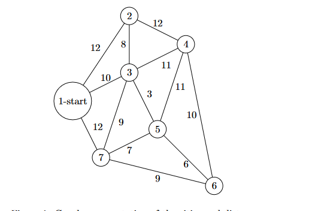

# Traveling Salesman Problem: Classical and SOM-Based Methods

## Group C Members

| Name                  | Registration Number |
|-----------------------|---------------------|
| Kato Adrian Mugerwa   | 24/U/25909/PS       |
| Tino Zoe Ramona       | 24/U/11508/PS       |
| Akankunda Rita        | 24/U/03072/PS       |
| Nakawunde Cana        | 24/U/08407/PS       |
| Ayesiga Calvin Rodney | 24/U/04101/PS       |

## TSP Representation and Data Structures

### Graph Representation



A good way to store the graph is by using a dictionary (hash table). Each city (key) maps to a list of tuples, where each tuple represents a connection to another city and the travel distance.

#### Adjacency List Representation (Python)

```python
graph = {
    1: [(2, 12), (3, 10), (7, 12)],
    2: [(1, 12), (3, 8), (4, 12)],
    3: [(1, 10), (2, 8), (4, 11), (5, 3), (7, 9)],
    4: [(2, 12), (3, 11), (5, 11), (6, 10)],
    5: [(3, 3), (4, 11), (6, 6), (7, 7)],
    6: [(4, 10), (5, 6), (7, 9)],
    7: [(1, 12), (3, 9), (5, 7), (6, 9)]
}
```

#### Justification
- **Efficient Lookup:** The adjacency list allows efficient lookup of neighbors and edge weights.
- **Space Efficiency:** Only stores existing connections, avoiding unnecessary memory usage.
- **Flexibility:** Easily handles graphs with varying degrees of connectivity.

### Problem Setup

#### TSP Objective
The objective of the Traveling Salesman Problem (TSP) is to visit each city exactly once and return to the starting city while minimizing the total travel distance.

#### Assumptions
- **Symmetric Distances:** The distance between two cities is the same in both directions.
- **Starting Point:** The starting city is predefined.
- **No Subtours:** The solution forms a single cycle including all cities.

## Classical TSP Solution

### Nearest Neighbor Algorithm
- Starts at an initial city.
- Repeatedly selects the nearest unvisited city.
- Returns to the starting city after visiting all others.

[Implementation: `nn.py`](nn.py)

#### Output
```
Route: 1 > 3 > 5 > 7 > 6 > 4 > 2
Total Distance: 63
```

## SOM-Based Approach

A Self-Organizing Map (SOM) is a type of artificial neural network used for unsupervised learning, applied here to find a heuristic solution to the TSP.

### Key Concepts
1. **Initializing Neurons:** Neurons represent potential solutions and are initially placed randomly.
2. **Neighborhood Function:** Adjusts neuron positions to align with the cities over iterations.
3. **Learning Rate:** Decays over time to fine-tune the solution.
4. **Representing Cities:** Each city is represented by coordinates on a 2D plane.

[Implementation: `som.py`](som.py)

#### Output
```
Final Route: 1 > 3 > 5 > 4 > 2 > 6 > 7 > 1
Total Distance: 57
```

## Challenges & Limitations of SOM for TSP

1. **Parameter Tuning Complexity:** Learning rate and neighborhood radius must be optimized carefully.
2. **Suboptimal Convergence:** SOM is designed for clustering, not exact path optimization.
3. **Handling Sparse Graphs:** Works best with fully connected graphs.
4. **Scaling Issues:** Computationally expensive for large graphs.
5. **No Guarantee of Global Optimality:** SOM provides a heuristic solution but may not be the best one.

## Analysis and Comparison

### (a) Route Quality
| Method | Route | Total Distance |
|--------|--------------------------------|----------------|
| Nearest Neighbor (NN) | `1 > 3 > 5 > 7 > 6 > 4 > 2` | 63 |
| Self-Organizing Map (SOM) | `1 > 3 > 5 > 4 > 2 > 6 > 7 > 1` | 57 |

- **SOM produced a shorter route** than NN, indicating better optimization.
- NN is greedy and may lead to suboptimal paths, whereas SOM has a more global view.

### (b) Complexity Discussion
| Method | Complexity |
|--------|------------|
| Nearest Neighbor (NN) | O(n²) |
| SOM | O(I × n²) |

- **Nearest Neighbor:** Quick but not always optimal.
- **SOM:** Higher computational cost but can provide better heuristics for larger problems.

### (c) Practical Considerations
| Scenario | Best Approach |
|----------|--------------|
| **Few Cities (n < 20)** | Use exact algorithms (e.g., dynamic programming) |
| **Medium Cities (20 ≤ n ≤ 100)** | SOM for near-optimal paths |
| **Large Cities (n > 1000)** | Heuristic methods (e.g., Genetic Algorithms, Ant Colony Optimization) |

### (d) Extensions & Improvements
1. **Hybrid SOM + Local Search:** Apply 2-opt or 3-opt refinement.
2. **Adaptive Learning Rates:** Dynamically adjust learning rates for better convergence.
3. **Alternative Distance Metrics:** Use Manhattan or geodesic distances for real-world applications.
4. **Metaheuristics (GA + SOM):** Use SOM to initialize, then refine with a genetic algorithm.

---


